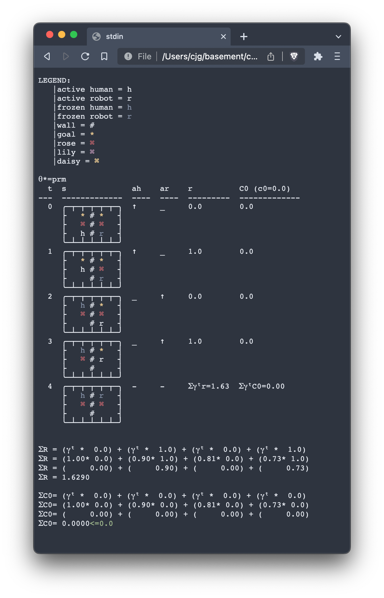

# Constraint Assistance Games

This repository can be used to solve _Constrant Assistance Games_, a constrained version
of [Assistance Games / Cooperative Inverse Reinforcement Learning](https://arxiv.org/abs/1606.03137).
It contains tools to define a variety of decision-making processes (each can be seen as a generalisation of an MDP).

```python
class DecisionProcess(ABC):
    """
    Specifies the abstract form of a decision-making process, which unifies MDPs, CMDPs and CAGs.
    Contains tools to validate the definition of a DP.

    Key Attributes: <S, A, T, R, I, γ> (and optionally c_k)
    """

...
    
class MDP(DecisionProcess, ABC):    

...
    
class CMDP(DecisionProcess, ABC):
    
...

class CAG(DecisionProcess, ABC):
  
...
```

Definiing a constraint assistance game just requires us to define the elements of
`<<S, A_h, a_r, T, R, γ>, <{C_k}_K,{c_k}_K>, I>`.
In practice, we define some internal features, and the abstract classes
`DecisionProcess` and  `CAG` perform validation etc.

```python
class ExampleCAG(CAG):
    # Define a state space (S)
    S: FiniteSpace = FiniteSpace(a_set_of_State_objects)

    # Defube the human and robot actions spaces h_A and r_A
    h_A: FrozenSet[Action] = frozenset({a_set_of_Action_objects})
    r_A: FrozenSet[Action] = frozenset({a_set_of_Action_objects})

    # Define the discount rate γ ∈ (0,1]
    gamma: float = 0.9

    # Define the budgets c_0, c_1, ..., c_k, ..., c_K ∈ Reals
    c_tuple: Tuple[float] = (10.0, 5.0)

    # Define the initialisation function over (S × Θ)
    initial_state_theta_dist: Distribution = UniformDiscreteDistribution(a_set_of_State_objects)

    # In practice, s_0 should be deterministic
    s_0 = a_State_object
    Theta: set = {a_set_of_parameters}

    # Define the internals of the transition function (T), this will be called by example_cag.T(s, (a_h, a_r))
    def _split_inner_T(self, s: State, h_a: Action, r_a: Action) -> Distribution:
        ...

    # Define the internals of the reward function (R), called by example_cag.R(s, (a_h, a_r))
    def _inner_split_R(self, s: State, h_a: Action, r_a: Action) -> float:
        ...

    # Define the internals of the reward function (C), called by example_cag.C(k, θ, s, (a_h, a_r))
    def _inner_C(self, k: int, theta, s: State, h_a: Action, r_a: Action) -> float:
        ...

    # define a method to check whether some state is a sink.
    # validation checks that these states self-loop and give 0 reward and cost
    def is_sink(self, s: State) -> bool:
        ...

```

We can then initialise the CAG, solve it and then
explore the solutions by wrapping the CAG in an OpenAI `gym.Env` object and "playing" it.:

```python 
cag = ExampleCAG()
cag_policy, solution_details = solve_CAG(cag)
explore_CAG_policy_with_env_wrapper(cag_policy, cag)
```

The output is rendered to a HTML file, such as the following:



##  

## Installation on Mac M1

Because of CPLEX, this repository currently requires python 3.7, on Mac M1 this can be installed via:

```bash
conda create -n <env-name>
conda activate <env-name>
conda config --env --set subdir osx-64
conda install python=3.7
```

Choose (A) or (B) depending on whether you have the professional version of CPLEX.

* **(A) If you have access to the professional version of CPLEX**, install it via the GUI. Then, install the python
  API: `pip install /Applications/CPLEX_Studio<xyz>/cplex/python/3.7/x86-64_osx`


* **(B) If you want to use the free (limited) version of CPLEX**, it can be installed
  via `conda install -c ibmdecisionoptimization cplex` (although this limits the problem size solvable).

Then install the remaining packages.

```
conda install numpy tqdm matplotlib tabulate colorama imagio
pip install enquiries pptree
conda install -c conda-forge gym
```

You can verify your install with:

```
cd <parent>/cags
python -m unittest discover -s ./tests/auto_tests
```